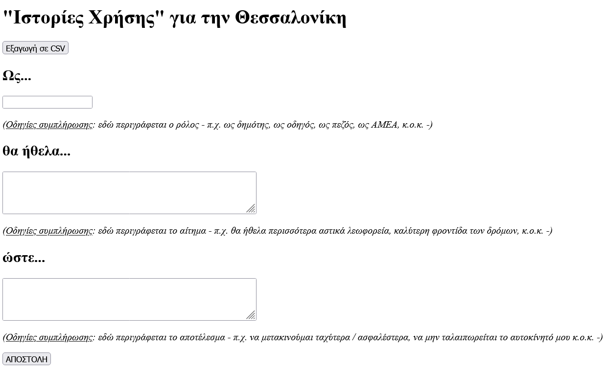
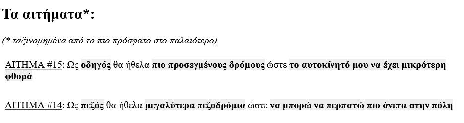

# City User Stories - Ιστορίες Χρήσης για την πόλη μου.

Σε αυτήν την πολύ απλή εφαρμογή οι χρήστες μπορούν με έναν εύκολο τρόπο να αποστέλλουν ανώνυμα τα αιτήματα για την πόλη στην οποία κατοικούν με την μορφή μιας ιστορίας που ακολουθεί το εξής σχήμα:

__Ως__ [ΡΟΛΟΣ]
__θα ήθελα__ [ΑΝΑΓΚΗ]
__ώστε__ [ΩΦΕΛΗΜΟ ΑΠΟΤΕΛΕΣΜΑ]

για παράδειγμα:

__Ως__ οδηγός
__θα ήθελα__ πιο προσεγμένους δρόμους
__ώστε__ το αυτοκίνητό μου να έχει μικρότερες φθορές

## Χρήση

Μπαίνοντας στην εφαρμογή ο χρήστης μπορεί να υποβάλλει το αίτημά του χωρίς να κάνει κάποιου είδους login χρησιμοποιώντας την παρακάτω φόρμα:

Αφότου πατήσει υποβολή η ιστορία του καταγράφεται στο "μητρώο" ιστοριών ακριβώς από κάτω.

## Εξαγωγή και χρήση δεδομένων

Όλες οι ιστορίες είναι διαθέσιμες προς κάθε ενδιαφερόμενο (Δήμοτικές Αρχές, Ακαδημαϊκούς, Ερευνητές, Πολίτες, κ.ο.κ.) για εξαγωγή σε μορφότυπο .CSV. Αυτό μπορεί να συμβεί κάνοντας κλικ στο κουμπί "Εξαγωγή σε .CSV" που υπάρχει στο πάνω μέρος της σελίδας. 

## Επαναχρησιμοποίηση της εφαρμογής

Η εφαρμογή αποτελεί Λογισμικό Ανοικτού Κώδικα (Open Source Software) και διατίθεται κάτω από άδεια [MIT License](https://github.com/akritiko/cityuserstories/blob/main/LICENSE). Μπορεί να επαναχρησιμοποιηθεί ελεύθερα και δωρεάν σύμφωνα με τους όρους της άδειας και χωρίς να έχετε την υποχρέωση να με αναφέρεται ως αρχικό δημιουργό (εάν το κάνετε όμως θα είναι χαρά και τιμή μου :D)

### Προαπαιτούμενα

- Apache Server
- PHP 7+
- MySQL Database

### Εγκατάσταση

1. Χρησιμοποιείστε το database_schema.sql για να δημιουργήσετε τη βάση δεδομένων του project
2. Κλωνοποιείστε το Github project
3. Σετάρετε το αρχείο config.php 

## Άδεια Χρήσης

MIT License

Copyright (c) 2022 Apostolos Kritikos

Permission is hereby granted, free of charge, to any person obtaining a copy
of this software and associated documentation files (the "Software"), to deal
in the Software without restriction, including without limitation the rights
to use, copy, modify, merge, publish, distribute, sublicense, and/or sell
copies of the Software, and to permit persons to whom the Software is
furnished to do so, subject to the following conditions:

The above copyright notice and this permission notice shall be included in all
copies or substantial portions of the Software.

THE SOFTWARE IS PROVIDED "AS IS", WITHOUT WARRANTY OF ANY KIND, EXPRESS OR
IMPLIED, INCLUDING BUT NOT LIMITED TO THE WARRANTIES OF MERCHANTABILITY,
FITNESS FOR A PARTICULAR PURPOSE AND NONINFRINGEMENT. IN NO EVENT SHALL THE
AUTHORS OR COPYRIGHT HOLDERS BE LIABLE FOR ANY CLAIM, DAMAGES OR OTHER
LIABILITY, WHETHER IN AN ACTION OF CONTRACT, TORT OR OTHERWISE, ARISING FROM,
OUT OF OR IN CONNECTION WITH THE SOFTWARE OR THE USE OR OTHER DEALINGS IN THE
SOFTWARE.
